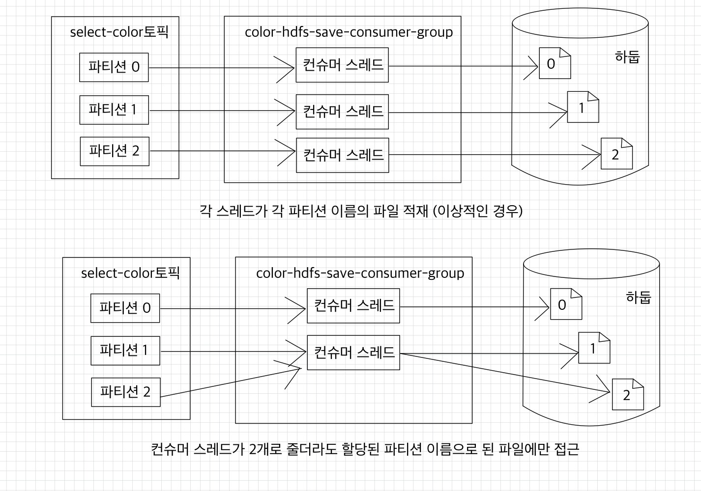

### 🧑🏻‍💻 데이터 저장 방식
데이터를 저장하는 방식은 append 방식과 flush 방식이 있다.
- append 방식: 파일이 없으면 파일을 생성하고, poll() 받은 데이터를 파일에 추가한다.  
  파일 개수를 늘리지 않고 계속해서 데이터를 추가할 수 있지만, 기존 적재하던 파일에 문제가 생기면 더는 append할 수 없다는 단점이 있다.
- flush 방식: 버퍼에 일정 기간 데이터를 쌓고 일정 수준이 되면 데이터를 저장하는 방식이다.  
  기존 적재된 파일에 이상이 생겼을 때 영향을 받지 않는 장점이 있지만, 파일 개수가 늘어나고 컨슈머 애플리케이션에 버퍼로 사용하는 메모리가 필요하다는 단점이 있다.

여기서는 flush 방식을 사용한다.  
버퍼에 쌓인 데이터가 10개가 넘는 경우 데이터를 저장하도록 개발하였다.

 

### 🧑🏻‍💻 컨슈머 멀티 스레드 환경
컨슈머 멀티 스레드 환경은 동일 데이터의 동시 접근에 유의해야 한다.  
여러 개의 컨슈머가 동일한 HDFS 파일에 접근을 시도한다면 교착 상태(deadlock)에 빠질 수 있는 위험이 있기 때문이다.  
➡ 가장 간단하면서도 명확한 방법은 파티션 번호에 따라 HDFS 파일을 따로 저장하는 것이다.  

  

1개의 컨슈머 스레드는 1개 이상의 파티션에 할당된다.  
➡ 해당 컨슈머 스레드에 할당된 파티션을 `assignment()` 메서드를 통해 확인하고, 데이터들을 각 파티션 번호를 붙인 파일에 저장한다.  
➡ 서로 다른 컨슈머 스레드가 동일 파일에 접근하는 것을 막을 수 있다.